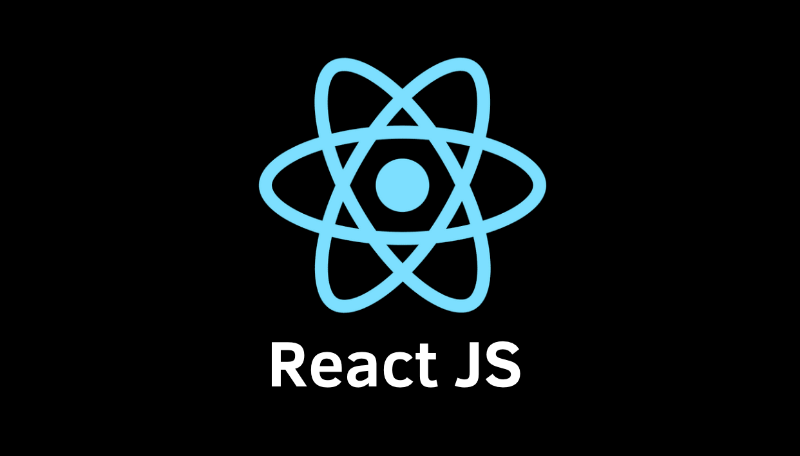
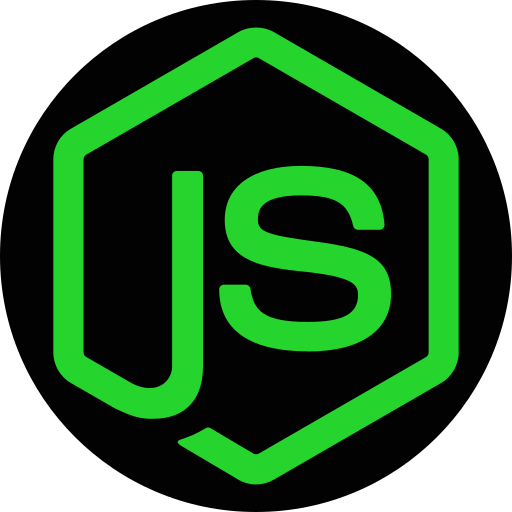
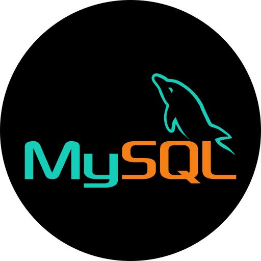
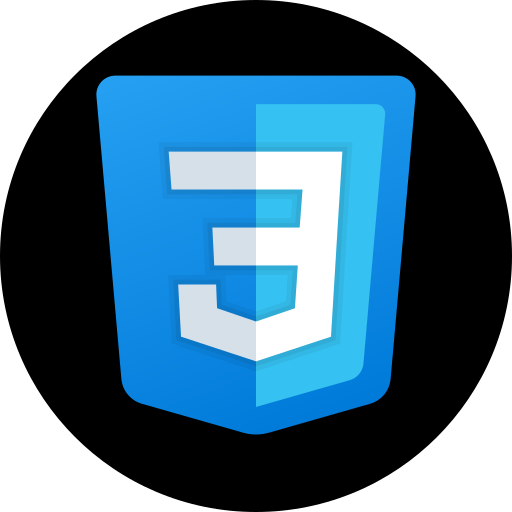

# Hello GitHub Friend 👋

***

- I'm a FullStack Web Developer

- 🔭 I’m working on FrontEnd Development with the help of ReactJS, TailwindCSS, CSS3 and HTML5 and for databases I'm using MongoDB
- 🌱 Currently learning more about BackEnd Development and I've already learned about NodeJS and it's framework ExpressJS
- 👯 I’m looking to collaborate with the person who have an project and looking for FrontEnd Developer
- 📫 How to reach me:
  - LinkedIn : <a href='https://www.linkedin.com/in/charvit-zalavadiya-1b34b3243/'>linkedin.com/in/CharvitZalavadiya</a>
  - Email : charvitzalavadiya@gmail.com

***

## 🛠 Languages & Tools

&nbsp;&nbsp;&nbsp;&nbsp;&nbsp;
&nbsp;&nbsp;&nbsp;&nbsp;&nbsp;
&nbsp;&nbsp;&nbsp;&nbsp;&nbsp;
&nbsp;&nbsp;&nbsp;&nbsp;&nbsp;
&nbsp;&nbsp;&nbsp;&nbsp;&nbsp;
&nbsp;&nbsp;&nbsp;&nbsp;&nbsp;
&nbsp;&nbsp;&nbsp;&nbsp;&nbsp;
&nbsp;&nbsp;&nbsp;&nbsp;&nbsp;
&nbsp;&nbsp;&nbsp;&nbsp;&nbsp;
&nbsp;&nbsp;&nbsp;&nbsp;&nbsp;

***

## 💻 PROJECTS

Musify - musify-cz.onrender.com
Orbital -charvitzalavadiya.github.io/orbital/
Portfolio -  charvitzalavadiya.netlify.app/
YouTube Clone - charvitzalavadiya.github.io/ytclone/
