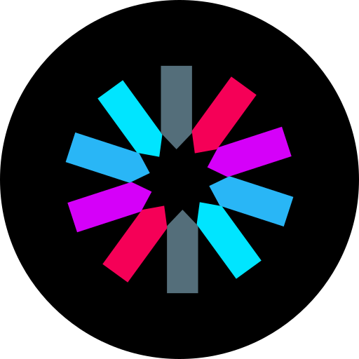

# Hello GitHub Friend 👋

***

- 🔭 I’m a Fullstack Developer
- 🌱 Currently learning more about Cloud Computing, DevOps and IoT
- 📫 How to reach me:
  - LinkedIn : <a href='https://www.linkedin.com/in/charvit-zalavadiya-1b34b3243/'>linkedin.com/in/CharvitZalavadiya</a>
  - X : <a href='https://twitter.com/Charvit_Z'>twitter.com/Charvit_Z</a>
  - Email : charvitzalavadiya@gmail.com

***

## 🛠 Tech Stack

| 📚 **Languages**  | &nbsp;&nbsp;&nbsp;&nbsp;&nbsp;&nbsp;&nbsp;&nbsp;&nbsp;&nbsp;&nbsp;&nbsp;&nbsp;&nbsp;&nbsp;&nbsp;&nbsp;&nbsp;&nbsp;&nbsp;&nbsp;&nbsp;&nbsp;&nbsp;&nbsp;&nbsp;&nbsp;&nbsp;&nbsp;&nbsp;&nbsp;&nbsp;&nbsp;&nbsp;&nbsp; |
|-------------------|---|
| 📟 **Frontend**   | &nbsp;&nbsp;&nbsp;&nbsp;&nbsp;&nbsp;&nbsp;&nbsp;&nbsp;&nbsp;&nbsp;&nbsp;&nbsp;&nbsp;&nbsp;&nbsp;&nbsp;&nbsp;&nbsp;&nbsp;&nbsp;&nbsp;&nbsp;&nbsp;&nbsp; |
| 🗄️ **Backend**     | &nbsp;&nbsp;&nbsp;&nbsp;&nbsp;&nbsp;&nbsp;&nbsp;&nbsp;&nbsp;&nbsp;&nbsp;&nbsp;&nbsp;&nbsp;&nbsp;&nbsp;&nbsp;&nbsp;&nbsp; |
| 🪄 **UI Libraries**| &nbsp;&nbsp;&nbsp;&nbsp;&nbsp;&nbsp;&nbsp;&nbsp;&nbsp;&nbsp;&nbsp;&nbsp;&nbsp;&nbsp;&nbsp;&nbsp;&nbsp;&nbsp;&nbsp;&nbsp; |
| 🗃️ **Databases**  | &nbsp;&nbsp;&nbsp;&nbsp;&nbsp;&nbsp;&nbsp;&nbsp;&nbsp;&nbsp;&nbsp;&nbsp;&nbsp;&nbsp;&nbsp;&nbsp;&nbsp;&nbsp;&nbsp;&nbsp; |
| 🛫 **Deployment**     | &nbsp;&nbsp;&nbsp;&nbsp;&nbsp;&nbsp;&nbsp;&nbsp;&nbsp;&nbsp;&nbsp;&nbsp;&nbsp;&nbsp;&nbsp; |
| ♾️ **DevOps**     | &nbsp;&nbsp;&nbsp;&nbsp;&nbsp;&nbsp;&nbsp;&nbsp;&nbsp;&nbsp;&nbsp;&nbsp;&nbsp;&nbsp;&nbsp;&nbsp;&nbsp;&nbsp;&nbsp;&nbsp;&nbsp;&nbsp;&nbsp;&nbsp;&nbsp;&nbsp;&nbsp;&nbsp;&nbsp;&nbsp;&nbsp;&nbsp;&nbsp;&nbsp;&nbsp; |
| 🤖 **Other Techs** | &nbsp;&nbsp;&nbsp;&nbsp;&nbsp;&nbsp;&nbsp;&nbsp;&nbsp;&nbsp;&nbsp;&nbsp;&nbsp;&nbsp;&nbsp;&nbsp;&nbsp;&nbsp;&nbsp;&nbsp;&nbsp;&nbsp;&nbsp;&nbsp;&nbsp;&nbsp;&nbsp;&nbsp;&nbsp;&nbsp;&nbsp;&nbsp;&nbsp;&nbsp;&nbsp;&nbsp;&nbsp;&nbsp;&nbsp;&nbsp; |
| 🦾 **Embedded**  | &nbsp;&nbsp;&nbsp;&nbsp;&nbsp;&nbsp;&nbsp;&nbsp;&nbsp;&nbsp;&nbsp;&nbsp;&nbsp;&nbsp;&nbsp;&nbsp;&nbsp;&nbsp;&nbsp;&nbsp;&nbsp;&nbsp;&nbsp;&nbsp;&nbsp; |
| 🎨 **Designing**  | &nbsp;&nbsp;&nbsp;&nbsp;&nbsp;&nbsp;&nbsp;&nbsp;&nbsp;&nbsp;&nbsp;&nbsp;&nbsp;&nbsp;&nbsp; |

<!-- #### 📚 Languages
&nbsp;&nbsp;&nbsp;&nbsp;&nbsp;
&nbsp;&nbsp;&nbsp;&nbsp;&nbsp;
&nbsp;&nbsp;&nbsp;&nbsp;&nbsp;
&nbsp;&nbsp;&nbsp;&nbsp;&nbsp;
&nbsp;&nbsp;&nbsp;&nbsp;&nbsp;
&nbsp;&nbsp;&nbsp;&nbsp;&nbsp;
&nbsp;&nbsp;&nbsp;&nbsp;&nbsp;
&nbsp;&nbsp;&nbsp;&nbsp;&nbsp;

#### 📟 Frontend
&nbsp;&nbsp;&nbsp;&nbsp;&nbsp;
&nbsp;&nbsp;&nbsp;&nbsp;&nbsp;
&nbsp;&nbsp;&nbsp;&nbsp;&nbsp;

#### 🗄️ Backend
&nbsp;&nbsp;&nbsp;&nbsp;&nbsp;
&nbsp;&nbsp;&nbsp;&nbsp;&nbsp;
&nbsp;&nbsp;&nbsp;&nbsp;&nbsp;

#### 🪄 UI Libraries
&nbsp;&nbsp;&nbsp;&nbsp;&nbsp;
&nbsp;&nbsp;&nbsp;&nbsp;&nbsp;
&nbsp;&nbsp;&nbsp;&nbsp;&nbsp;
&nbsp;&nbsp;&nbsp;&nbsp;&nbsp;

#### 🗃️ Databases
&nbsp;&nbsp;&nbsp;&nbsp;&nbsp;
&nbsp;&nbsp;&nbsp;&nbsp;&nbsp;
&nbsp;&nbsp;&nbsp;&nbsp;&nbsp;

#### 🛫 Deplyment
&nbsp;&nbsp;&nbsp;&nbsp;&nbsp;
&nbsp;&nbsp;&nbsp;&nbsp;&nbsp;
&nbsp;&nbsp;&nbsp;&nbsp;&nbsp;

#### ♾️ DevOps
&nbsp;&nbsp;&nbsp;&nbsp;&nbsp;
&nbsp;&nbsp;&nbsp;&nbsp;&nbsp;
&nbsp;&nbsp;&nbsp;&nbsp;&nbsp;
&nbsp;&nbsp;&nbsp;&nbsp;&nbsp;

#### 🤖 Other Techs
&nbsp;&nbsp;&nbsp;&nbsp;&nbsp;
&nbsp;&nbsp;&nbsp;&nbsp;&nbsp;
&nbsp;&nbsp;&nbsp;&nbsp;&nbsp;
&nbsp;&nbsp;&nbsp;&nbsp;&nbsp;
&nbsp;&nbsp;&nbsp;&nbsp;&nbsp;
&nbsp;&nbsp;&nbsp;&nbsp;&nbsp;
&nbsp;&nbsp;&nbsp;&nbsp;&nbsp;

#### 🦾 Embedded
&nbsp;&nbsp;&nbsp;&nbsp;&nbsp;
&nbsp;&nbsp;&nbsp;&nbsp;&nbsp;
&nbsp;&nbsp;&nbsp;&nbsp;&nbsp;
&nbsp;&nbsp;&nbsp;&nbsp;&nbsp;

#### 🎨 Web Designing
&nbsp;&nbsp;&nbsp;&nbsp;&nbsp;
&nbsp;&nbsp;&nbsp;&nbsp;&nbsp;
&nbsp;&nbsp;&nbsp;&nbsp;&nbsp; -->

***

## 💻 Projects

  Portfolio ( New )

  

    
       
      Repo
    
    
      
      Live
    
  

  <ul style="margin-left: -20px; margin-bottom: -5px; margin-right: 10px; text-align: justify">
    <li>Developed a full-stack portfolio website using Next.js and React, showcasing personal projects with live demos and source code links.</li>
    <li>Designed a modular MacOS like, user-focused interface to highlight project accomplishments, technical skills, and professional experience for recruiters and collaborators.</li>
  </ul>

  

    
       
      NextJS
    
    
      
      TailwindCSS
    
  

  Mindmaps

  

    
       
      Repo
    
    
      
      Live
    
  

  <ul style="margin-left: -20px; margin-bottom: -5px; margin-right: 10px; text-align: justify">
    <li>Built a flowchart builder with 2 node shapes, 6 node colors, and can be search by title or color of flowchart.</li>
    <li>It is a cutting-edge platform that uses AES encryption technique to store data of 35 real users and 5+ active users</li>
    <li>It allows users to create, manage, and organize tasks with 7 color-coded notes. It also have feature for filtering notes for quick access based on title, color of the notes.</li>
    <li>On top of that user can send friend requests to friends on the same platform, and can have a real-time chat where messages are delivered in just 0.5 seconds for seamless communication experience.</li>
  </ul>

  

    
       
      NextJS
    
    
      
      ExpressJS
    
    
      
      MongoDB
    
    
      
      Clerk
    
    
      
      Socket.io
    
    
      
      TailwindCSS
    
    
      
      ShadCN
    
  

  HideOn

  

    
       
      Repo
    
    
      
      Live
    
  

  <ul style="margin-left: -20px; margin-bottom: -5px; margin-right: 10px; text-align: justify">
    <li>Deployed an encryption-decryption website for cipher execution, supporting 13 ciphers including modern techniques.</li>
    <li>Enabled encryption and decryption via console commands, with plans to integrate a GUI for improved usability.</li>
  </ul>

  

    
       
      Vite
    
    
       
      ReactJS
    
    
      
      CSS
    
    
      
      ShadCN
    
  

  Browser Landing Page

  

    
       
      Repo
    
    
      
      Live
    
  

  <ul style="margin-left: -20px; margin-bottom: -5px; margin-right: 10px; text-align: justify">
    <li>A unique, re-imagined browser startup page made for large screens (laptops & monitors, 15”+).</li>
    <li>It offers a sleek and focused user experience with an emphasis on SEO, a minimal UI (50% fewer distractions), and smooth navigation (30% faster access to content).</li>
  </ul>

  

    
       
      Firebase
    
    
       
      Vite
    
    
       
      ReactJS
    
    
      
      SCSS
    
  

  Portfolio ( Old )

  

    
       
      Repo
    
    
      
      Live
    
  

  <ul style="margin-left: -20px; margin-bottom: -5px; margin-right: 10px; text-align: justify">
    <li>Simple portfolio which showcases about me, my education, skills, projects and contact details with modern UI and subtle animations.</li>
  </ul>

  

    
       
      Vite
    
    
       
      ReactJS
    
    
      
      CSS
    
  

  Planet Info

  

    
       
      Repo
    
    
      
      Live
    
  

  <ul style="margin-left: -20px; margin-bottom: -5px; margin-right: 10px; text-align: justify">
    <li>Just built to get started with Web Development.</li>
    <li>It is nothing new or informative.</li>
  </ul>

  

    
       
      HTML
    
    
      
      CSS
    
  

***

## 📈 Experience

  Software Developer
  
  
@Rebelminds

  <ul style="margin: -15px 10px 10px -20px; text-align: justify">
    <li>Built and deployed 50+ APIs in 14 days (ExpressJS, FastAPI), increasing backend speed by 22%.</li>
    <li>Developed customer web portal and delivery partner app (React Native, Expo Go) with FCM, achieving 9ms notification latency.</li>
    <li>Migrated backend from FastAPI to ExpressJS, redesigned 3+ schemas, and set up JWT authentication.</li>
    <li>Created 16 modular MCP tools for MongoDB and FastAPI, automating agent workflows.</li>
  </ul>

  

    
       
      ExpressJS
    
    
      
      Supabase
    
    
      
      Prisma ORM
    
    
      
      Vite
    
    
      
      ReactJS
    
    
      
      Docker
    
    
      
      Framer Motion
    
    
      
      FastAPI
    
    
      
      JWT
    
    
      
      Firebase
    
    
      
      Expo GO ( React Native)
    
    
      
      Postman
    
    
      
      Ngrok
    
    
      
      Cypress
    
  

***

## 📊 Status of GitHub

 

<!--    -->

 

***

---

<!-- <picture>
  <source media="(prefers-color-scheme: dark)" srcset="https://raw.githubusercontent.com/CharvitZalavadiya/CharvitZalavadiya/output/pacman-contribution-graph-dark.svg">
  <source media="(prefers-color-scheme: light)" srcset="https://raw.githubusercontent.com/CharvitZalavadiya/CharvitZalavadiya/output/pacman-contribution-graph.svg">
  
</picture> -->
